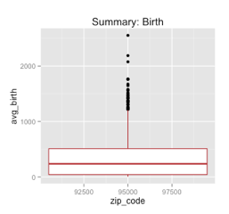
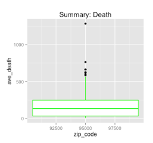

#Summary
####In this project, the team is trying to explore the births and deaths in California. We will be first be comparing the rates of births and deaths, then we will explore further into factors such as race, age, area by zip_code, death causes, and other contributing elements.

##Birth Rate:
####In the following boxplot, we will see the average birth rates in California by zip code.

####In this graph, we can easily identify the 5 number summary of average birth rates in the state of California.

##Death Rate:
####Next, will will see the average death rates in California by zip code.

####For easier comparison, we chose to produce another boxplot that shares the same information.
#####Notice there are less outliers in the death graph. Also, the death graph shows less deaths than births.

####To reproduce this, follow these instructions:
######1.) Using R Studio, make sure the correct packages are loaded (ggplot2, RCurl, reshape2, and tidyr).
######2.) For the birth plot, we used piping to manipulate the birth data by first grouping it by zip_code, then summarizing it by avg(total_birth), and lastly, producing a graph using ggplot.
######3.) For the death plot, follow the same instructions but change the variables accordingly.

##Birth with Race as a factor:
####In this graph, we made an interactive Tableau image with quick filter to see birth rates by race.

####In this particular screen shot, we have located places with most Hawaiian and Pacific Islanders. However, there is a quick filter set to see any race preferred.

####To reproduce this, follow these instructions:
######1.) Drag latitude onto rows and longitude onto columns.
######2.) Put value to label and color.
######3.) Drag zip_code to detail.
######4.) Edit color to blue green diverging for easier interpretation.
######5.) Drag variable to filters.

##Death by Cause in California:
####In this graph, we show crosstab on zip code, variable, and label. This shows main cause of deaths in each zip code.

####This chart shows that HEART DISEASE is the leading cause of death in most zip codes. CANCER is a close second.

####To reproduce this, follow these instructions:
######1.) First, we created a melted data frame of the death data using R.
######2.) Then we created a death_codes.xls file to translate the death codes to legible death causes.
######3.) Using "Connect to Data" in Tableau, we connected to both files, and blended the data. The join is on "Variable" and "Label".
######4.) Then we put zip code, variable, and label into Rows, and then SUM(Values) into columns.
######5.) We then also dragged Values into color and size so each zip code could show how many people die from each cause.
######6.) We now wanted to know the leading cause of death in each zip code, so we created a table calculation on values, set to Rank.
######7.) That ranked deaths throughout California, so we edited the Table Calculation to partition by Zip Code.
######8.) Then we used a Quick Filter to only show "1" as rank. This gave us the top cause of death in each zip code.

###Special Note:
###We ran a SQL query to create a new table of most prominent race by zip code.
#####CREATE TABLE m_births_max_race AS
#####(SELECT a.zip_code, a.variable, a.value FROM
#####  (SELECT zip_code, value, variable
#####	FROM m_births
#####	WHERE variable LIKE 'race_%') a
#####JOIN
#####	(SELECT zip_code, MAX(value) AS highest_count
#####	FROM m_births
#####	WHERE variable LIKE 'race_%'
#####	GROUP BY zip_code) b
#####ON a.zip_code = b.zip_code
#####AND a.value = b.highest_count)

##Population Growth:
####In this graph, we demonstrate the population growth by zipcode.

####This graph shows that population growth varies depending on the area.

####To reproduce this, follow these instructions:
######1.) First we joined the California death count data with the birth count data.
######2.) Then we performed a field calculation to determine the net gain/loss of population as a result of births and deaths.
######3.) Finally, we overlaid the data by Zip.

##Code onto a Geographical Symbol Map:
####In this graph, we explored how race and age affect birth rates in each area. This shows the predominant Race/Age for births in CA zips.

####With this visualization, we can clearly see that Hispanics around the age 20 to 29 contribute the most to the numbers of births in California.

####To reproduce this, follow these instructions:
######1.) For the top two graphs we did a table calculation summing the total birth counts for all race and age groups.
######2.) For the bottom two graphs we found the predominant age and race groups for each zip.

#Conclusion:
####In this report, we analyzed all factors that would contribute to the births and deaths of Californians. We summarized the possible outcomes as each elements affect the life cycle in this particular state. Lastly, we looked at the differences between total births and total deaths by area to see how the population is growing or declining.

